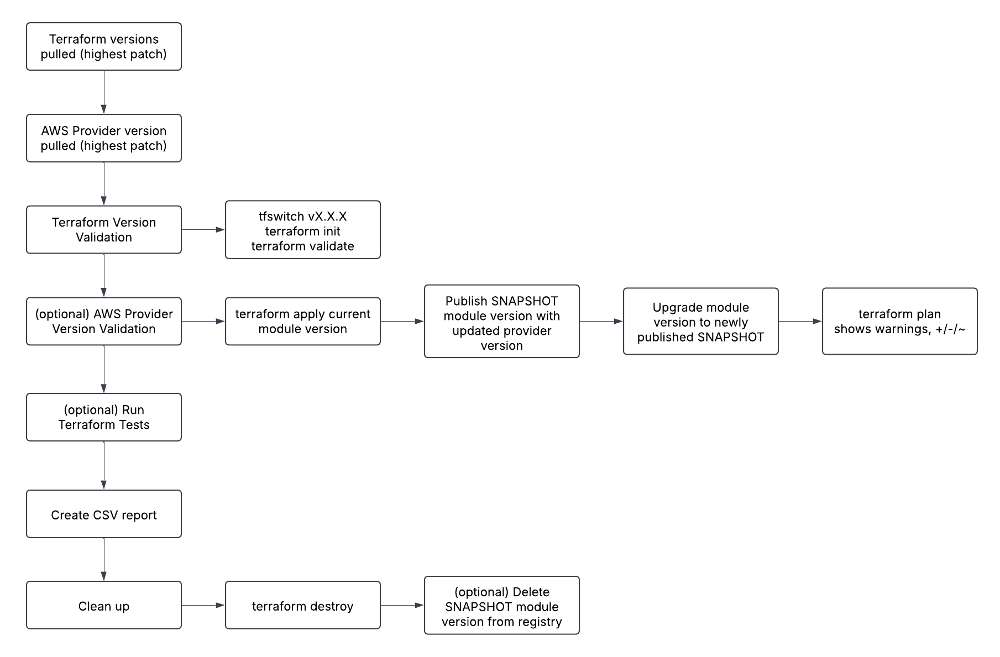
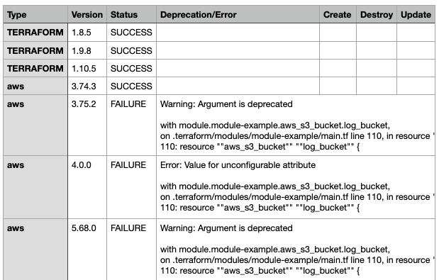

# Module Version Tester

This repository contains a Jenkins pipeline and supporting scripts to test a Terraform module against multiple versions of Terraform and provider versions. The pipeline creates a CSV of the report of any changes produced by the testing.

- For Terraform versions: tests against a minimum version of v1.4.0.
- For Provider versions: tests against providers released on https://releases.hashicorp.com/ with terraform-provider-xxxx

## Files

- **`Jenkinsfile`**: The main Jenkins pipeline script.
- **`plan_extractor.py`**: A Python script to parse Terraform plan logs and extract resource changes into a CSV file.
- **`get_releases.sh`**: A script to fetch the highest minor releases of the AWS provider from GitHub (currently not used in the pipeline).

## Prerequisites

- Jenkins with the following plugins:
  - Pipeline
  - Git
  - JUnit
- Terraform CLI installed on the Jenkins agent.
- `tfswitch` installed on the Jenkins agent for switching Terraform versions.
- Access to a Terraform Cloud/Enterprise organization for publishing modules.
- Credentials for GitHub and Terraform Cloud/Enterprise.

## Module Prequisites:
- `examples/` holds `module{}` blocks with version specified
- `required_versions` and `required_providers with` constraints in `terraform.tf`
- `version.txt` exists with current version of module 

## Pipeline Parameters

| Parameter                | Description                                                                                     |
|--------------------------|-------------------------------------------------------------------------------------------------|
| `GIT_REPO_URL`           | Git repository URL to clone.                                                                   |
| `GIT_BRANCH`             | Git branch to clone.                                                                           |
| `MODULE_NAME`            | Name of the module.                                                                            |
| `TERRAFORM_VERSIONS`     | Single or comma-separated list of Terraform versions to test. Leave blank if using MIN_TERRAFORM_VERSION or MAX_TERRAFORM_VERSION.                                            |
| `MIN_TERRAFORM_VERSION`  | Minimum Terraform version to test. Leave blank if using TERRAFORM_VERSIONS                                                         |
| `MAX_TERRAFORM_VERSION`  | Maximum Terraform version to test. Leave blank if using TERRAFORM_VERSIONS                                                             |
| `TEST_PROVIDER_VERSIONS` | (OPTIONAL) Whether to test provider versions.                                                             |
| `PROVIDER`               | Provider to test (e.g., `aws`).                                                                |
| `PROVIDER_VERSION`       | Single or comma-separated list of provider versions to test. Leave blank if using MIN_PROVIDER_VERSION or MAX_PROVIDER_VERSION.                                             |
| `MIN_PROVIDER_VERSION`   | Minimum provider version to test. Leave blank if using PROVIDER_VERSION                                                              |
| `MAX_PROVIDER_VERSION`   | Maximum provider version to test. Leave blank if using PROVIDER_VERSION                                                              |
| `RUN_TERRAFORM_TESTS`    | (OPTIONAL) Whether to run Terraform tests.                                                           |
| `DELETE_SNAPSHOT`        | (OPTIONAL) Whether to delete snapshot versions after testing.                                             |

## High Level Pipeline Flow

## Pipeline Tips

- Deploy under an ephemeral workspace (TFE v202502-2) to ensure destruction of temporary resources
- Workspace using Vault backed dynamic credentials to AWS, no issues worrying about timeout since credentials will be valid for the duration of the run

## Example Output

The pipeline generates a CSV report (`module_versions_results.csv`) that looks like:

## Customizing the Pipeline for Your Environment

The code is an example! You'll need to tweak the code to make it work for you.
If you want to use this pipeline in your own environment, you may need to make the following changes:

1. Terraform Cloud/Enterprise (TFE) Instance URL
2. Organization Name
3. Workspace Name
4. Read through the [module preqs](#module-prequisites), the pipeline was written with a specific module structure in mind
